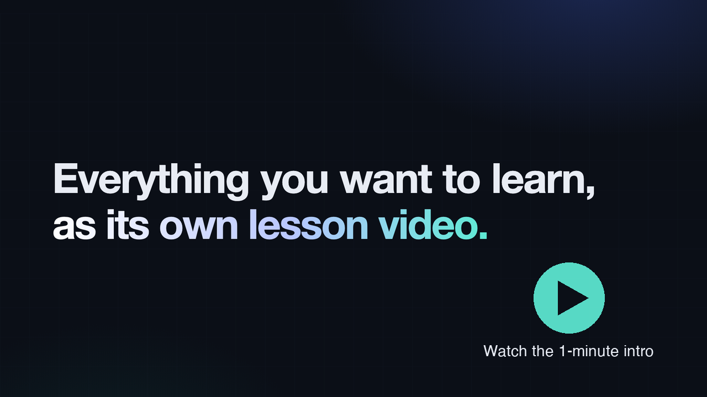
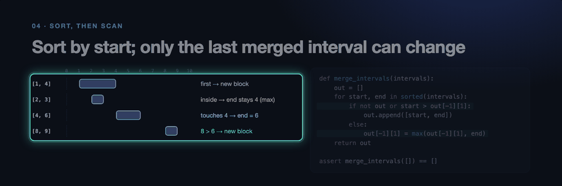
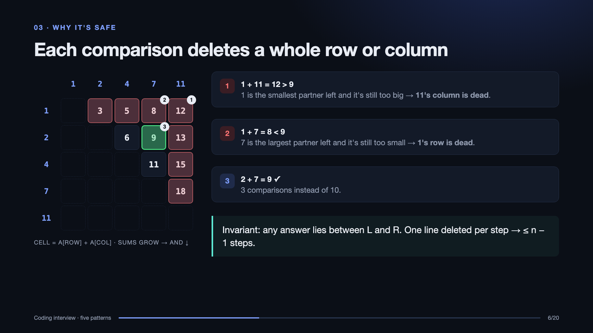

# teachme

**Ask Claude Code to teach you anything, and get a narrated lesson video back.** It comes with slides that prove each idea step by step, and a player whose spotlight follows every sentence.

[](https://github.com/ShemYu/teachme/releases/download/v1.0.0/teachme-release-v1.0.0.mp4)

## Use it in 3 steps

**1. Install** (macOS with Google Chrome and Python 3.9+):

```bash
git clone https://github.com/ShemYu/teachme ~/.claude/skills/teachme
~/.claude/skills/teachme/scripts/setup.sh
```

**2. Ask Claude Code for a lesson**, in plain words or with the slash command:

```
teach me how Raft leader election works, as a video
/teachme sliding window problems, senior interview level
```

**3. Watch.** In about 20 minutes Claude hands you two things:
- **`<topic>.mp4`**: a 1080p narrated video with subtitles that plays anywhere, including your phone. The narration is leveled to a steady -16 LUFS, and the captions also come as `<topic>.srt` (add `--burn-subs` for a copy with the captions drawn into the picture).
- **`player/index.html`**: the same lesson in your browser, with a spotlight on whatever is being said, plus chapters and sentence-by-sentence seeking.

## What makes it different



- **It shows the mechanism instead of describing it.** Ideas are proved visually, one change at a time. One recurring picture builds up across the lesson, inspired by 3Blue1Brown.

  

- **The code on screen has been run.** Every snippet comes from a `solutions.py` that's tested, often against a brute-force answer on thousands of random inputs.
- **The spotlight player** dims everything except the exact table row, code line, or card being narrated. That makes it easy to review, and to rehearse a talk in presenter mode.
- **It's senior-level by default.** Lessons cover mechanisms, real numbers, tradeoffs, failure modes, and sources, not definitions. Each lesson keeps a `SOURCES.md` that maps every number and claim to where it came from.
- **Voices: free or premium.** The free voice is macOS `say`. ElevenLabs is optional, with the cost shown before anything is billed.
- **It stays in its lane.** It makes study lessons only, and doesn't trigger for release videos, demos, or promos.

**Compared with no skill**, on the same Raft prompt, one run per round: teachme passed 11/11 (baseline 9/11) in round 1, and 12/12 (baseline 9/12) in round 2 with the new cluster diagram. teachme added depth, tested code, the paper citation, and the review player; the round-2 baseline also miscounted votes in its main example.

## Good prompts to try

- `teach me how two pointers work, as a video` (an algorithm, with visual proofs)
- `make me a lesson on HNSW vs IVF-PQ vs DiskANN with a tradeoff table` (a design choice, with a decision framework)
- `help me prepare for a system design interview on rate limiters` (interview prep)
- `turn my notes in ./project.md into a 10-minute talk I can rehearse` (a first-person script, then use presenter mode)

## Example lessons

The source for these is in [`lessons/`](lessons). Each one builds into an MP4 and a player, with output in `~/teachme-lessons/examples/`:

| Lesson | Runtime | Shows |
|---|---|---|
| `coding-interview-patterns` | ~18 min | Visual proofs: pair grid, trace frames, interval bars, tested `solutions.py` |
| `agentic-video-understanding` | ~16.5 min | The reference example |
| `hybridrag-vs-wikirag` | ~16 min | Tradeoff matrix and decision framework |
| `agent-security-observability` | ~17 min | Interview prep: one prompt worked end to end |
| `agent-system-design` | ~15.5 min | Agent architecture around a ticket-to-PR coding agent |

```bash
cd ~/.claude/skills/teachme
.venv/bin/python scripts/build_player.py coding-interview-patterns --validate   # player
.venv/bin/python scripts/build_video.py  coding-interview-patterns              # MP4
```

## What it costs

Measured on a 19-minute lesson with 21 slides:

| Stage | Time | Cost |
|---|---|---|
| Claude writing the lesson | ~15–20 min | ≈ $2.50 at API rates for Claude Opus 5.5¹ |
| Narration with macOS `say` | 1.5 min | free |
| Narration with ElevenLabs (17,210 characters) | 2.6 min | ≈ $1.38² |
| Rendering the MP4 and the player | ~3 min | free |

¹ Measured from the session transcript: 22 model calls; 56k output, 123k cache-write, and 1.8M cache-read tokens. On a Claude Pro or Max plan this counts against your plan's usage limits instead.
² `--estimate` prints the exact figure for your lesson before anything is billed.

## Optional: ElevenLabs voice

```bash
.venv/bin/python scripts/keys.py set                                                  # hidden prompt, or a native dialog when Claude runs it
.venv/bin/python scripts/build_player.py <name> --tts elevenlabs --estimate   # characters, ≈ USD, plan left; spends nothing
.venv/bin/python scripts/build_player.py <name> --tts elevenlabs              # synthesizes once into a per-sentence cache
.venv/bin/python scripts/build_video.py  <name> --tts elevenlabs              # the MP4 reuses that cache, so you're billed once
```

Or just tell Claude "use the ElevenLabs voice". It shows you the estimate and asks before spending. Paid builds stop at `--max-chars` (default 30,000), or when your plan is out of characters. Rebuilds only bill sentences whose text changed.

**Your key never touches the repo or the chat.** Keys resolve through a small registry (`scripts/secret_store.py`): environment variable → macOS Keychain → Linux Secret Service. When Claude runs `keys.py set`, you type the key into a native password dialog, and Claude only sees `saved sk_…abcd`. To add your own store (1Password, Vault…), subclass `SecretBackend` and add `@register`. There's a full example in the module docstring.

## Reference

| Path | What |
|---|---|
| `SKILL.md` | Instructions Claude follows, including when not to trigger |
| `references/authoring.md` | Slide API, theme and visual-proof components, narration and focus-cue rules |
| `references/sources-template.md` | Template for a lesson's `SOURCES.md` (every number and claim, with its source) |
| `scripts/build_video.py`, `scripts/build_player.py` | MP4 and focus-player builders |
| `scripts/common.py`, `scripts/narration.py` | Lesson loading, Chrome/ffmpeg helpers; TTS backends and cache |
| `scripts/visuals.py` | Visual-proof components: tested code panels, arrays with pointers, trace frames, pair grid, intervals |
| `scripts/secret_store.py`, `scripts/keys.py`, `scripts/elevenlabs_api.py`, `scripts/tts_voices.py` | Secrets registry and CLI, ElevenLabs helpers |
| `assets/theme.css`, `assets/player.html` | Slide theme and the player template |
| `lessons/<name>/` | Example lessons (`lesson.py`, `focus_cues.py`, optional `solutions.py`) |
| `tests/` | Unit tests (`pytest -q tests`; no Chrome, `say`, or network needed) |
| `evals/evals.json` | Trigger and quality prompts for iterating on the skill |

**Your lessons live in `~/teachme-lessons/<name>/`**, outside the skill folder, so `git pull` never collides with your work. Set `TEACHME_LESSONS` to use another folder. Scripts accept a lesson's path or just its name. Building one of the bundled examples writes its output to `~/teachme-lessons/examples/<name>/build/`. Lessons are Python files and run with your permissions, so only build lessons you trust.

## Contributing

See [CONTRIBUTING.md](CONTRIBUTING.md). For security issues, see [SECURITY.md](SECURITY.md). `VERSION` follows semver, and built MP4s carry it in their metadata.

## License

[MIT](LICENSE)
